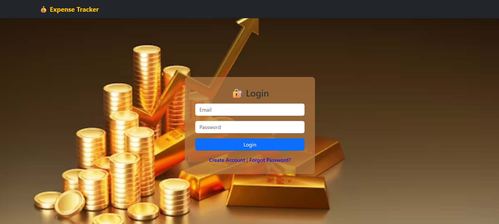
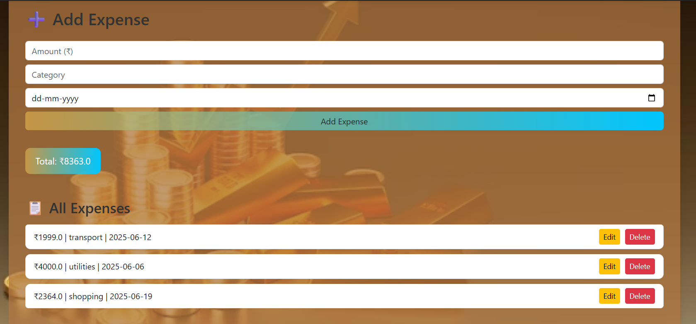
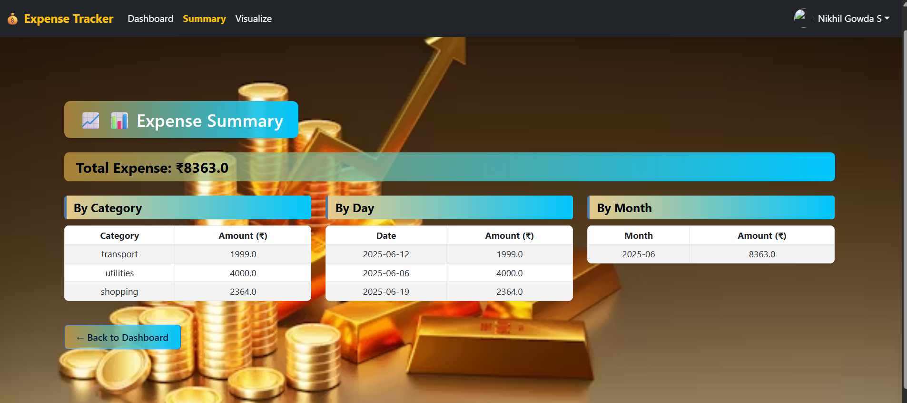
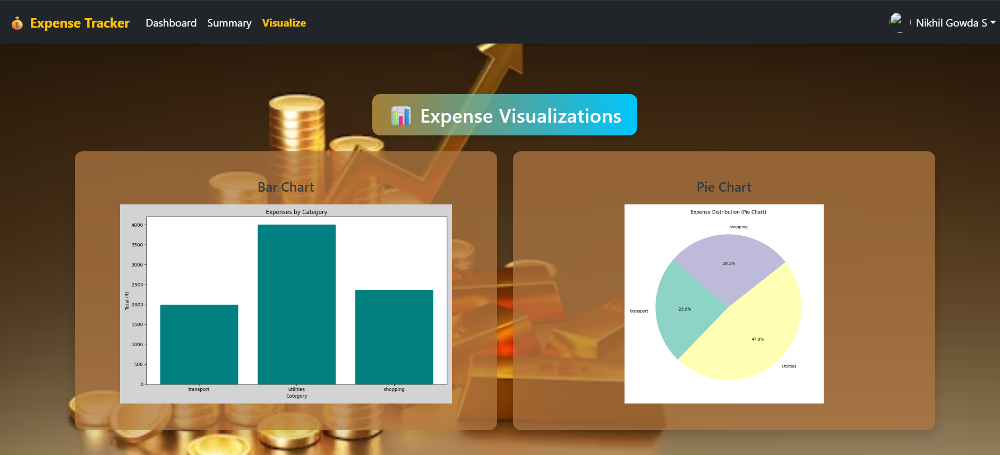
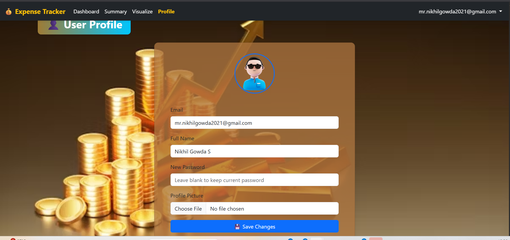
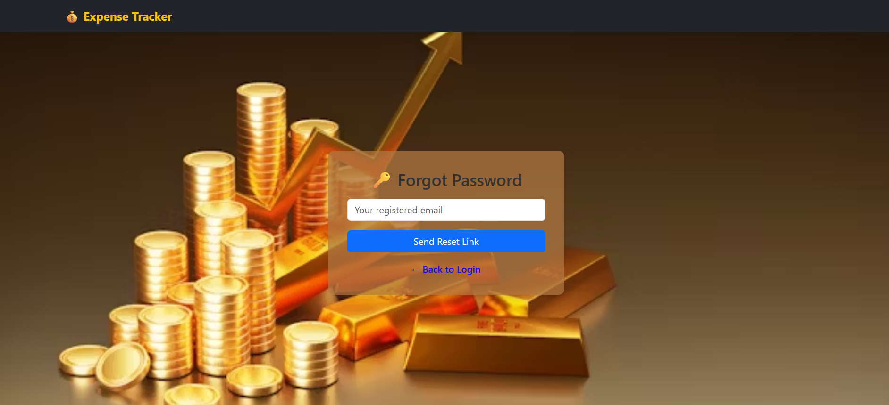
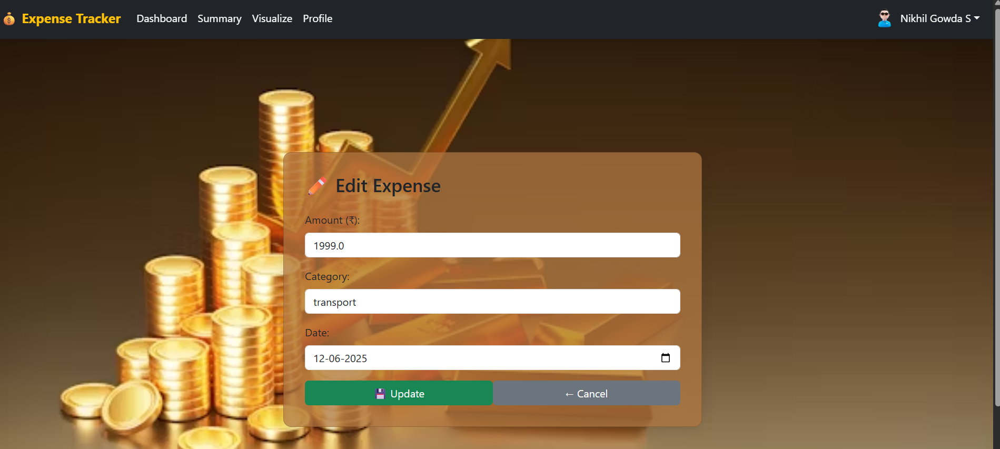
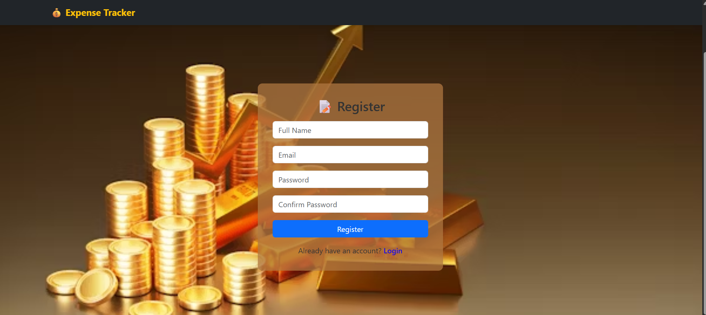

# 💰 Expense Tracker Web App

A personal finance tracking web application built with **Flask**, **MongoDB**, and **Bootstrap**. Users can register, log in, manage their expenses, and visualize spending data with summary tables and charts. Now fully responsive and deployed on Render!

---

## 🚀 Features

- ✅ User registration and login
- ✅ Email & password validation
- ✅ Password reset via email simulation
- ✅ Add, edit, delete expenses
- ✅ Expense summary by category, day, month
- ✅ Chart visualizations using Chart.js
- ✅ Mobile-responsive UI with Bootstrap 5
- ✅ MongoDB Atlas integration
- ✅ Deployed on Render for free hosting

---

## 🛠 Tech Stack

- **Frontend**: HTML5, CSS3, Bootstrap 5
- **Backend**: Python (Flask)
- **Database**: MongoDB Atlas
- **Authentication**: Flask-Login, Flask-Bcrypt
- **Deployment**: Render
- **Charting**: Chart.js

---

### 📸 Screenshots

#### 🔐 Login Page


#### 📝 Add Expenses


#### 🧾 Summary View


#### 📈 Visualization


#### 🧑‍💼 Profile


#### 🔄 Forgot Password


#### ✏️ Edit Expense


#### 🔐 Register


---

## ⚙️ Setup Instructions

1. **Clone this repo**
   ```bash
   git clone https://github.com/NikhilGowda03/Expense_tracker.git
   cd Expense_tracker
2. Create a virtual environment
python -m venv venv
source venv/bin/activate  # or venv\Scripts\activate on Windows

3.Install dependencies
pip install -r requirements.txt

4. Setup .env variables
   Create a .env file and add:
MONGO_URI=mongodb+srv://<username>:<password>@cluster.mongodb.net/expense_tracker
SECRET_KEY=your_secret_key

5.Run the app
python app.py

6.Visit
http://localhost:5000

## 🌐 Live Demo
🔗 [Live on Render](https://expense-tracker-oc0l.onrender.com)

